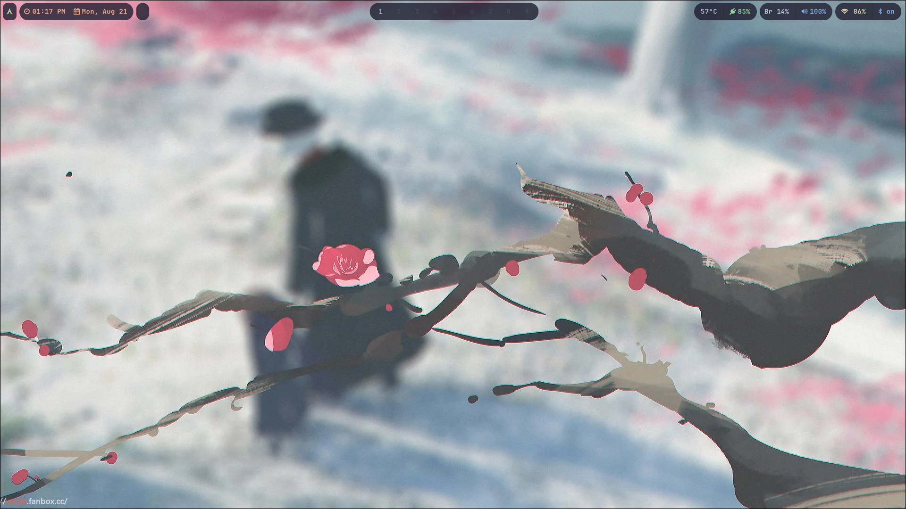
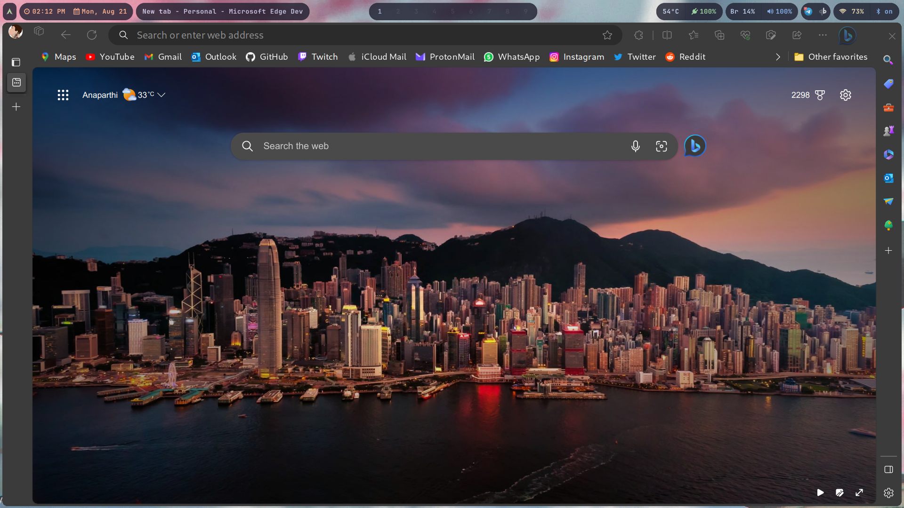
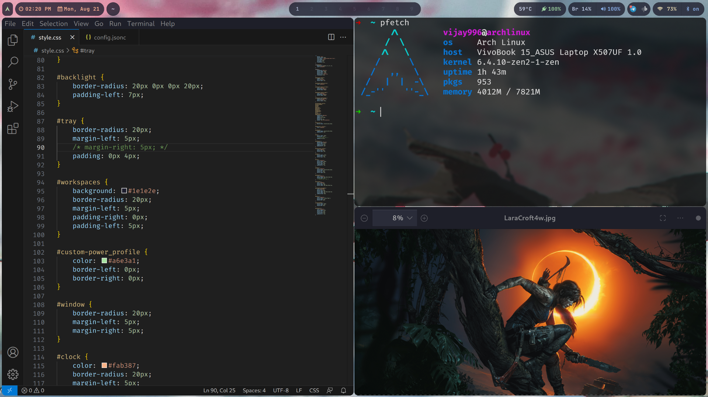

# doties
## Packages(for personal use):
```
paru -Syu android-tools base base-devel blueman bluez bluez-utils brightnessctl cliphist copyq dunst ffmpegthumbnailer font-manager fuzzel grim gvfs-mtp haruna hyprpaper intel-ucode kdialog libpulse light tldr lxappearance man-db mpv nano npm ntfs-3g openssh pavucontrol pipewire-alsa pipewire-jack pipewire-pulse polkit-gnome poppler-glib python python-dasbus qt5-styleplugins qt5-wayland qt5ct qt6-wayland qt6ct rar slurp sshfs swaylock thunar thunar-archive-plugin thunar-volman ttf-apple-emoji ttf-cascadia-code ttf-fira-code ttf-jetbrains-mono-nerd ttf-material-design-iconic-font ttf-ms-fonts tumbler vim webp-pixbuf-loader wget wireplumber wl-clipboard wofi xdg-user-dirs xfce4-settings yay yt-dlp zip zsh clipman cloudflare-warp-bin dracula-gtk-theme dracula-icons-git fastfetch pfetch gopsuinfo gtklock hyprpicker-git hyprshot linux-wifi-hotspot nwg-drawer nwg-look sddm-theme-astronaut swayosd-git ttf-apple-emoji visual-studio-code-bin wlogout wlsunset wofi-emoji socat 
```

## Sample Screenshots:



<!--  -->

### Credits:
<ul>
    <li>@end-4 for the base hyprland config</li>
    <li>@vidowner for the waybar theme</li>
</ul>
